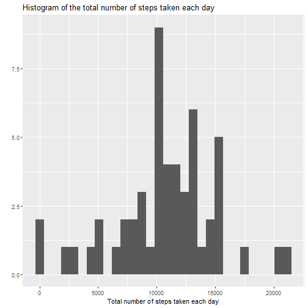
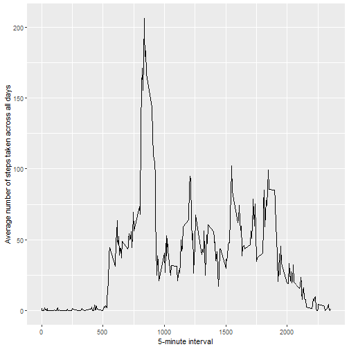
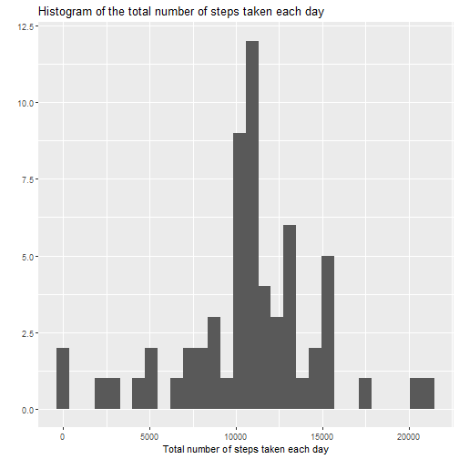
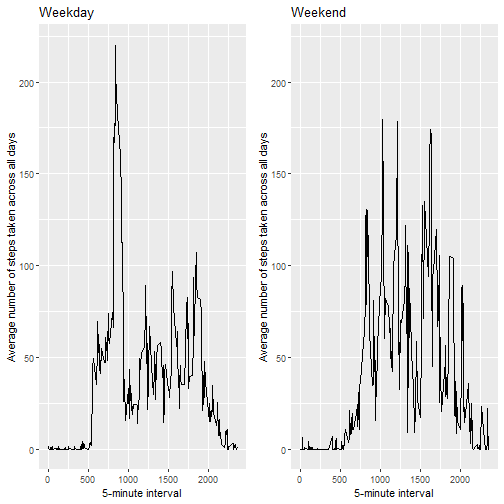

### Loading and preprocessing the data


1. Load the data. 

First, the working directory is setted, the data is loaded from the given file and it's reviewed:


```r
setwd(directory)
data <- read.csv("activity.csv")
str(data)
```

```
## 'data.frame':	17568 obs. of  3 variables:
##  $ steps   : int  NA NA NA NA NA NA NA NA NA NA ...
##  $ date    : chr  "2012-10-01" "2012-10-01" "2012-10-01" "2012-10-01" ...
##  $ interval: int  0 5 10 15 20 25 30 35 40 45 ...
```

2. Process/transform the data (if necessary) into a format suitable for your analysis.

The dates are coerced into characters, these are changed into dates and we're good to go:


```r
data$date <- as.Date(data$date, "%Y-%m-%d")
str(data)
```

```
## 'data.frame':	17568 obs. of  3 variables:
##  $ steps   : int  NA NA NA NA NA NA NA NA NA NA ...
##  $ date    : Date, format: "2012-10-01" "2012-10-01" "2012-10-01" ...
##  $ interval: int  0 5 10 15 20 25 30 35 40 45 ...
```

### What is the mean total number of steps taken per day?

NOTE: For this part of the assignment, missing values in the dataset where ignored as indicated.

1. Calculate the total number of steps taken per day.


```r
results <- tapply(data$steps,data$date, FUN = sum)
results
```

```
## 2012-10-01 2012-10-02 2012-10-03 2012-10-04 2012-10-05 2012-10-06 2012-10-07 2012-10-08 2012-10-09 
##         NA        126      11352      12116      13294      15420      11015         NA      12811 
## 2012-10-10 2012-10-11 2012-10-12 2012-10-13 2012-10-14 2012-10-15 2012-10-16 2012-10-17 2012-10-18 
##       9900      10304      17382      12426      15098      10139      15084      13452      10056 
## 2012-10-19 2012-10-20 2012-10-21 2012-10-22 2012-10-23 2012-10-24 2012-10-25 2012-10-26 2012-10-27 
##      11829      10395       8821      13460       8918       8355       2492       6778      10119 
## 2012-10-28 2012-10-29 2012-10-30 2012-10-31 2012-11-01 2012-11-02 2012-11-03 2012-11-04 2012-11-05 
##      11458       5018       9819      15414         NA      10600      10571         NA      10439 
## 2012-11-06 2012-11-07 2012-11-08 2012-11-09 2012-11-10 2012-11-11 2012-11-12 2012-11-13 2012-11-14 
##       8334      12883       3219         NA         NA      12608      10765       7336         NA 
## 2012-11-15 2012-11-16 2012-11-17 2012-11-18 2012-11-19 2012-11-20 2012-11-21 2012-11-22 2012-11-23 
##         41       5441      14339      15110       8841       4472      12787      20427      21194 
## 2012-11-24 2012-11-25 2012-11-26 2012-11-27 2012-11-28 2012-11-29 2012-11-30 
##      14478      11834      11162      13646      10183       7047         NA
```

2. Make a histogram of the total number of steps taken each day.


```r
library(ggplot2)
qplot(results,main ='Histogram of the total number of steps taken each day',xlab = 'Total number of steps taken each day')
```



3. Calculate and report the mean and median of the total number of steps taken per day.


```r
results <- cbind(results,tapply(data$steps,data$date, FUN = mean),tapply(data$steps,data$date, FUN = median))
colnames(results) <- c('Total (sum)','Mean','Median')
results
```

```
##            Total (sum)       Mean Median
## 2012-10-01          NA         NA     NA
## 2012-10-02         126  0.4375000      0
## 2012-10-03       11352 39.4166667      0
## 2012-10-04       12116 42.0694444      0
## 2012-10-05       13294 46.1597222      0
## 2012-10-06       15420 53.5416667      0
## 2012-10-07       11015 38.2465278      0
## 2012-10-08          NA         NA     NA
## 2012-10-09       12811 44.4826389      0
## 2012-10-10        9900 34.3750000      0
## 2012-10-11       10304 35.7777778      0
## 2012-10-12       17382 60.3541667      0
## 2012-10-13       12426 43.1458333      0
## 2012-10-14       15098 52.4236111      0
## 2012-10-15       10139 35.2048611      0
## 2012-10-16       15084 52.3750000      0
## 2012-10-17       13452 46.7083333      0
## 2012-10-18       10056 34.9166667      0
## 2012-10-19       11829 41.0729167      0
## 2012-10-20       10395 36.0937500      0
## 2012-10-21        8821 30.6284722      0
## 2012-10-22       13460 46.7361111      0
## 2012-10-23        8918 30.9652778      0
## 2012-10-24        8355 29.0104167      0
## 2012-10-25        2492  8.6527778      0
## 2012-10-26        6778 23.5347222      0
## 2012-10-27       10119 35.1354167      0
## 2012-10-28       11458 39.7847222      0
## 2012-10-29        5018 17.4236111      0
## 2012-10-30        9819 34.0937500      0
## 2012-10-31       15414 53.5208333      0
## 2012-11-01          NA         NA     NA
## 2012-11-02       10600 36.8055556      0
## 2012-11-03       10571 36.7048611      0
## 2012-11-04          NA         NA     NA
## 2012-11-05       10439 36.2465278      0
## 2012-11-06        8334 28.9375000      0
## 2012-11-07       12883 44.7326389      0
## 2012-11-08        3219 11.1770833      0
## 2012-11-09          NA         NA     NA
## 2012-11-10          NA         NA     NA
## 2012-11-11       12608 43.7777778      0
## 2012-11-12       10765 37.3784722      0
## 2012-11-13        7336 25.4722222      0
## 2012-11-14          NA         NA     NA
## 2012-11-15          41  0.1423611      0
## 2012-11-16        5441 18.8923611      0
## 2012-11-17       14339 49.7881944      0
## 2012-11-18       15110 52.4652778      0
## 2012-11-19        8841 30.6979167      0
## 2012-11-20        4472 15.5277778      0
## 2012-11-21       12787 44.3993056      0
## 2012-11-22       20427 70.9270833      0
## 2012-11-23       21194 73.5902778      0
## 2012-11-24       14478 50.2708333      0
## 2012-11-25       11834 41.0902778      0
## 2012-11-26       11162 38.7569444      0
## 2012-11-27       13646 47.3819444      0
## 2012-11-28       10183 35.3576389      0
## 2012-11-29        7047 24.4687500      0
## 2012-11-30          NA         NA     NA
```

### What is the average daily activity pattern?

1. Time series plot of the 5-minute interval (x-axis) and the average number of steps taken, averaged across all days (y-axis)


```r
data <- na.omit(data)
result <- tapply(data$steps,data$interval, FUN = mean)
qplot(as.numeric(names(result)),matrix(result),geom='line',xlab='5-minute interval',ylab='Average number of steps taken across all days')
```



2. Which 5-minute interval, on average across all the days in the dataset, contains the maximum number of steps?


```r
names(result)[match(max(result),result)]
```

```
## [1] "835"
```

### Imputing missing values

1. Calculate and report the total number of missing values in the dataset.

I have to load again the data, since the original data set was changed.


```r
data <- read.csv("activity.csv")
data$date <- as.Date(data$date, "%Y-%m-%d")

sum(is.na(data))
```

```
## [1] 2304
```

```r
sum(is.na(data$steps))
```

```
## [1] 2304
```

Now, all the missing values from the dataset come from the steps variable...

2. Devise a strategy for filling in all of the missing values in the dataset.

For filling the missing values, I've chosen to use the mean for the 5-minute interval, obtained in the previous assignment. 

3. Create a new dataset that is equal to the original dataset but with the missing data filled in.


```r
good_data <- data

for(i in 1:length(good_data$steps)){
  if (is.na(good_data$steps[i]) == TRUE){
    good_data$steps[i] <- result[as.character(good_data$interval[i])]
  }
}

sum(is.na(good_data))
```

```
## [1] 0
```

4. Make a histogram of the total number of steps taken each day and Calculate and report the mean and median total number of steps taken per day. Do these values differ from the estimates from the first part of the assignment? What is the impact of imputing missing data on the estimates of the total daily number of steps?


```r
res <- tapply(good_data$steps,good_data$date, FUN = sum)

qplot(res,main ='Histogram of the total number of steps taken each day',xlab = 'Total number of steps taken each day')
```



```r
res <- cbind(res,tapply(good_data$steps,good_data$date, FUN = mean),tapply(good_data$steps,good_data$date, FUN = median))
colnames(res) <- c('Total (sum)','Mean',"Median")
res
```

```
##            Total (sum)       Mean   Median
## 2012-10-01    10766.19 37.3825996 34.11321
## 2012-10-02      126.00  0.4375000  0.00000
## 2012-10-03    11352.00 39.4166667  0.00000
## 2012-10-04    12116.00 42.0694444  0.00000
## 2012-10-05    13294.00 46.1597222  0.00000
## 2012-10-06    15420.00 53.5416667  0.00000
## 2012-10-07    11015.00 38.2465278  0.00000
## 2012-10-08    10766.19 37.3825996 34.11321
## 2012-10-09    12811.00 44.4826389  0.00000
## 2012-10-10     9900.00 34.3750000  0.00000
## 2012-10-11    10304.00 35.7777778  0.00000
## 2012-10-12    17382.00 60.3541667  0.00000
## 2012-10-13    12426.00 43.1458333  0.00000
## 2012-10-14    15098.00 52.4236111  0.00000
## 2012-10-15    10139.00 35.2048611  0.00000
## 2012-10-16    15084.00 52.3750000  0.00000
## 2012-10-17    13452.00 46.7083333  0.00000
## 2012-10-18    10056.00 34.9166667  0.00000
## 2012-10-19    11829.00 41.0729167  0.00000
## 2012-10-20    10395.00 36.0937500  0.00000
## 2012-10-21     8821.00 30.6284722  0.00000
## 2012-10-22    13460.00 46.7361111  0.00000
## 2012-10-23     8918.00 30.9652778  0.00000
## 2012-10-24     8355.00 29.0104167  0.00000
## 2012-10-25     2492.00  8.6527778  0.00000
## 2012-10-26     6778.00 23.5347222  0.00000
## 2012-10-27    10119.00 35.1354167  0.00000
## 2012-10-28    11458.00 39.7847222  0.00000
## 2012-10-29     5018.00 17.4236111  0.00000
## 2012-10-30     9819.00 34.0937500  0.00000
## 2012-10-31    15414.00 53.5208333  0.00000
## 2012-11-01    10766.19 37.3825996 34.11321
## 2012-11-02    10600.00 36.8055556  0.00000
## 2012-11-03    10571.00 36.7048611  0.00000
## 2012-11-04    10766.19 37.3825996 34.11321
## 2012-11-05    10439.00 36.2465278  0.00000
## 2012-11-06     8334.00 28.9375000  0.00000
## 2012-11-07    12883.00 44.7326389  0.00000
## 2012-11-08     3219.00 11.1770833  0.00000
## 2012-11-09    10766.19 37.3825996 34.11321
## 2012-11-10    10766.19 37.3825996 34.11321
## 2012-11-11    12608.00 43.7777778  0.00000
## 2012-11-12    10765.00 37.3784722  0.00000
## 2012-11-13     7336.00 25.4722222  0.00000
## 2012-11-14    10766.19 37.3825996 34.11321
## 2012-11-15       41.00  0.1423611  0.00000
## 2012-11-16     5441.00 18.8923611  0.00000
## 2012-11-17    14339.00 49.7881944  0.00000
## 2012-11-18    15110.00 52.4652778  0.00000
## 2012-11-19     8841.00 30.6979167  0.00000
## 2012-11-20     4472.00 15.5277778  0.00000
## 2012-11-21    12787.00 44.3993056  0.00000
## 2012-11-22    20427.00 70.9270833  0.00000
## 2012-11-23    21194.00 73.5902778  0.00000
## 2012-11-24    14478.00 50.2708333  0.00000
## 2012-11-25    11834.00 41.0902778  0.00000
## 2012-11-26    11162.00 38.7569444  0.00000
## 2012-11-27    13646.00 47.3819444  0.00000
## 2012-11-28    10183.00 35.3576389  0.00000
## 2012-11-29     7047.00 24.4687500  0.00000
## 2012-11-30    10766.19 37.3825996 34.11321
```

The values that prevously had NA values are the ones that changed after the replacement. The impact of imputing missing data depends on the approach that was used to fill those data, it's not the same when the repacement is done with the mean or the median rather than zero. Thus, the differences between the first and the last histogram. 

### Are there any differences in activity patterns betwen weekdays and weekends?

1. Create a new factor variable in the dataset with two levels - "weekday" and "weekend" indicating whether a given date is a weekday or weekend day.


```r
for(i in 1:length(good_data$date)){
  if (weekdays(good_data$date[i]) == 's攼㸱bado' | weekdays(good_data$date[i]) == 'domingo'){
    good_data$day[i] <- 'weekend'
  } else good_data$day[i] <- 'weekday'
}

good_data$day <- as.factor(good_data$day)
str(good_data)
```

```
## 'data.frame':	17568 obs. of  4 variables:
##  $ steps   : num  1.717 0.3396 0.1321 0.1509 0.0755 ...
##  $ date    : Date, format: "2012-10-01" "2012-10-01" "2012-10-01" ...
##  $ interval: int  0 5 10 15 20 25 30 35 40 45 ...
##  $ day     : Factor w/ 2 levels "weekday","weekend": 1 1 1 1 1 1 1 1 1 1 ...
```

2. Make a panel plot containing a time series plot of the 5-minute interval (x-axis) and the average number of steps taken, averaged across all weekday days or weekend days (y-axis).


```r
library(dplyr)
library(gridExtra)

sub1 <- subset(good_data,day=='weekend')
sub2 <- subset(good_data,day=='weekday')

r1 <- tapply(sub1$steps,sub1$interval, FUN = mean)
r2 <- tapply(sub2$steps,sub2$interval, FUN = mean)

lim <- max(range(r1),range(r2))

p1 <- qplot(as.numeric(names(r1)),matrix(r1),geom='line',main = 'Weekend',xlab='5-minute interval',ylab='Average number of steps taken across all days',ylim=c(0,lim))

p2 <- qplot(as.numeric(names(r2)),matrix(r2),geom='line',main = 'Weekday',xlab='5-minute interval',ylab='Average number of steps taken across all days',ylim=c(0,lim))

grid.arrange(p2,p1,nrow = 1)
```


